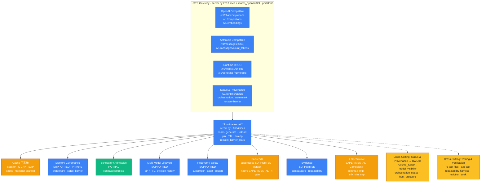
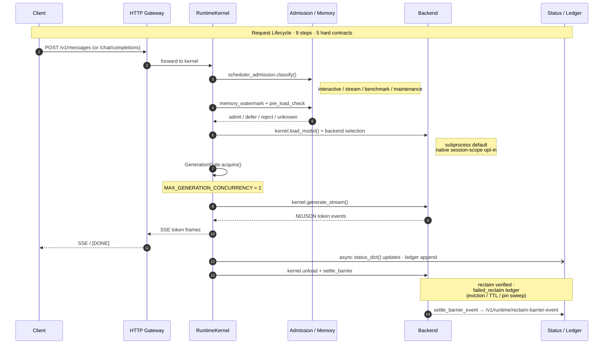
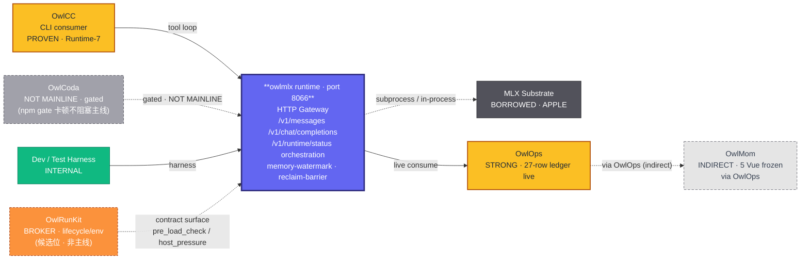
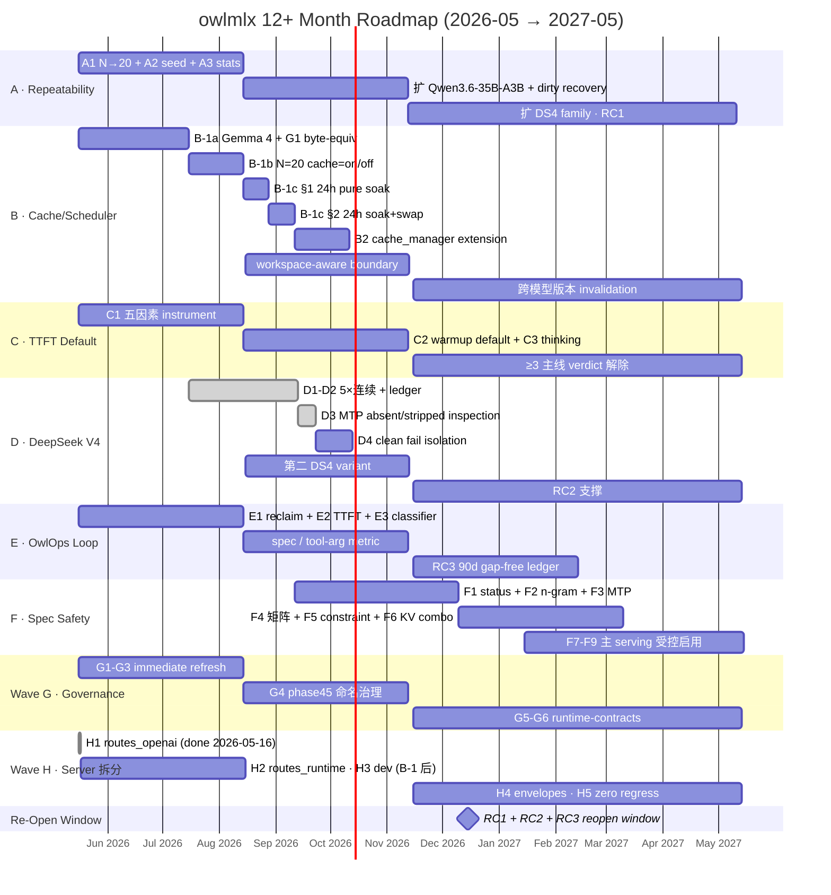

# owlmlx 架构画布 · 系统 / 功能 / 业务逻辑 / 路线图

> **文档 grade**：plan-grade · 见 [README.md](README.md)
> **配套**：[01-mainline-roadmap.md](01-mainline-roadmap.md) / [02-state-vs-market-gap.md](02-state-vs-market-gap.md) / [03-real-accomplishments.md](03-real-accomplishments.md)
> **日期**：2026-05-16
> **形式**：mermaid + 表格 + ASCII（仓内 markdown · G-b2 决策）

---

## 0. 阅读约定

**状态图例**：

| 标签 | 含义 |
|---|---|
| ✅ supported | 已过 §1a Promotion Gate |
| 🟡 partial | 部分实装，路线图深化中 |
| 🟠 experimental | probe / scaffold-only |
| 🔴 not-in-scope | 刻意不做，明确边界 |
| ⬜ external | comparison reference only |
| ⭐ consumer | 内部消费者 |

---

## 1. 系统架构 · System Architecture

> 按 `docs/source-of-truth/system-architecture.md` 已冻结的**四层独立性边界**。原则：**runtime truth flows upward** —— 上层消费、不重定义。外部参考系统仅作 comparison benchmark，**非** extraction source，**非**身份来源。

### 1.1 四层 + 外部参考 + 邻接资产

```mermaid
flowchart TB
    classDef supported fill:#3b82f6,stroke:#1e40af,color:#fff
    classDef partial fill:#10b981,stroke:#047857,color:#fff
    classDef experimental fill:#f59e0b,stroke:#b45309,color:#fff
    classDef notinscope fill:#52525b,stroke:#27272a,color:#fff
    classDef external fill:#fafafa,stroke:#71717a,color:#1f2937,stroke-dasharray:4 3
    classDef consumer fill:#fbbf24,stroke:#b45309,color:#1f2937
    classDef adjacent fill:#fb923c,stroke:#9a3412,color:#fff,stroke-dasharray:4 3
    classDef transitional fill:#a1a1aa,stroke:#52525b,color:#fff,stroke-dasharray:4 3

    subgraph L4["LAYER 04 · Product Integration"]
        OwlOps["OwlOps<br/>live · 27-row ledger"]:::consumer
        OwlCoda["OwlCoda<br/>NOT MAINLINE · gated"]:::transitional
        OwlMom["OwlMom<br/>5 Vue frozen · indirect"]:::consumer
        Shell["Desktop Shell<br/>(local-llm-platform)"]:::external
    end

    subgraph L3["LAYER 03 · Runtime Paths"]
        LWP["Large-Weight Path<br/>Kimi / Gemma 4"]:::supported
        STD["Standard Interactive<br/>Qwen3.6 family"]:::partial
        FUT["Future paths"]:::notinscope
    end

    subgraph L2["LAYER 02 · owlmlx Core Runtime · OWNED"]
        HTTP["HTTP Gateway<br/>FastAPI · port 8066"]:::supported
        Kernel["RuntimeKernel<br/>kernel.py · 1694 lines"]:::supported
        Memory["Memory Governance<br/>PR #649 aligned"]:::supported
        Lifecycle["Multi-Model Lifecycle<br/>pin / TTL / eviction"]:::supported
        Status["Status & Provenance<br/>→ OwlOps"]:::supported
        Cache["Cache<br/>session_kv 7.4×<br/>cache_manager scaffold"]:::partial
        Sched["Scheduler / Admission"]:::partial
        Recovery["Recovery / Safety"]:::partial
        Evidence["Evidence<br/>repeatability · A/B"]:::supported
        Backends["Backends<br/>subprocess + native (4-gate)"]:::experimental
        Spec["⚡ Speculative<br/>Campaign F · scaffold"]:::experimental
        Hetero["⚠ Heterogeneous Compute<br/>GPU/CPU/ANE"]:::notinscope
        CB["⚠ Continuous Batching / Paged KV"]:::notinscope
    end

    subgraph L1["LAYER 01 · MLX Substrate · APPLE"]
        MLX["mlx >= 0.22.0"]:::external
        MLXLM["mlx-lm >= 0.22.0"]:::external
        MLXVLM["mlx-vlm 0.5.0"]:::external
    end

    L4 -.->|"consume runtime truth ↑"| L3
    L3 --> L2
    L2 -->|"substrate API ↓"| L1
```



### 1.2 External Reference（comparison only · 不是依赖、不是身份来源）

| 系统 | 定位 | 与 owlmlx 关系 |
|---|---|---|
| **oMLX** | Apple Silicon multi-host fleet | replacement target（boundary 层替代） |
| **vMLX** (vmlx.net) | Apple 官方背书全栈 | throughput-first 同场景对比；owlmlx 走 reliability + governance 差异化 |
| **vllm-mlx** (waybarrios) | continuous batching on MLX | 单 worker by design 不追 |
| **vLLM / SGLang** | speculative 平台化（MTP / EAGLE-3） | Campaign F 参考但不复刻 |
| **Apple FM (Tahoe+)** | OS-level · 单一模型 | 不冲突；远期 backend Protocol hook |
| **Ollama / LM Studio** | 消费级 runtime | 不交叉（消费级 vs 企业级） |
| **llama.cpp / GGUF** | 跨平台通用基座 | 不接 GGUF（专注 MLX 格式） |
| **mlx-knife** v2.0.5 | HF 模型生命周期工具 | 与 OwlRunKit 协作位 |

### 1.3 Adjacent Assets（owlmlx 生态内 · 非主线）

| 资产 | 类别 | 与 owlmlx 边界 |
|---|---|---|
| **OwlRunKit** | BROKER | lifecycle / env broker 候选位（venv 切换、模型 artifact 下载、host preflight）；owlmlx 暴露 `pre_load_check` / `host_pressure` / `model_visibility` 供其调用；**不**下沉到 owlmlx 内部 |
| **`llm_router`** | TRANSITIONAL | 过渡资产；**不**入 owlmlx mainline；owlmlx replacement-grade 后由 mainline 替代或 OwlOps 上收 |

### 1.4 架构原则（Bottom Band）

```
┌─────────────────────────────────────────────────────────────────────┐
│  ARCHITECTURE PRINCIPLE                                              │
│                                                                       │
│  Runtime truth flows upward · 主线 = owlmlx runtime mainline         │
│  非 OwlCoda、非 llm_router；上层消费、不重定义。                       │
│                                                                       │
│  上层不可重定义 runtime 边界；borrowed 实现细节不可定义 owlmlx 身份。 │
└─────────────────────────────────────────────────────────────────────┘
```

---

## 2. 功能架构 · Functional Architecture

> Layer 02 内部展开。HTTP Gateway（`server.py · 2013 行` + `server_routes_openai.py · 829 行`）是所有外部入口；RuntimeKernel（`kernel.py · 1694 行`）是中央协调器；下面挂 5 大子系统 + 2 cross-cutting + 1 实验路径。

### 2.1 总览



### 2.2 子系统详情

| 子系统 | 状态 | 关键文件 |
|---|---|---|
| HTTP Gateway | ✅ | `owlmlx/runtime/server.py` (2013 行 · Wave H H1 后) + `owlmlx/runtime/server_routes_openai.py` (829 行) |
| RuntimeKernel | ✅ | `owlmlx/runtime/kernel.py` (1694 行) |
| Cache | 🟠/🟡 | `session_kv_cache.py` (EXP · 7.4×) · `cache_manager.py` (scaffold) · `cache_truth.py` · `cache_residency_tracker.py` |
| Memory Governance | ✅ | `memory_watermark.py` · `settle_barrier_event.py` · `memory_pressure_classifier.py` · `memory_pressure_eviction_policy.py` · `memory_budget.py` · `memory_actuator.py` |
| Scheduler / Admission | 🟡 | `scheduler_admission.py` · `model_load_admission.py` · `nonresident_model_admission_policy.py` · `serving.py` (GenerationGate · MAX=1) |
| Multi-Model Lifecycle | ✅ | `model_inventory.py` · `model_lineage.py` · `model_profile.py` · `model_residency_policy.py` · `model_release_candidate_program` (§8) · `model_release_candidate_history.py` (live) |
| Recovery / Safety | ✅ | `abort_recovery.py` · `recovery_supervisor.py` · `termination_recovery_policy.py` |
| Backends | ✅+🟠 | `mlx_lm_subprocess_backend.py` (2541 行 · SUPPORTED · default) · `mlx_native_backend.py` (1074 行 · EXP · 4-gate promote) |
| Evidence | ✅ | `comparative_evidence_runner.py` (41K) · `comparative_evidence_history.py` (live) · `repeatability_statistics.py` |
| Speculative | 🟠 | `gemma4_mtp_drafter.py` (2.86/7 rounds smoke) · `runtime/mlx_vlm_mtp_runner.py` |

### 2.3 Campaign → Module 映射

| Campaign | 主战场模块 |
|---|---|
| **A** Repeatability | `test_repeatability_campaign_harness.py` · `repeatability_statistics.py` |
| **B** Cache / Scheduler | `session_kv_cache.py` · `cache_manager.py` · `scheduler_admission.py` · `memory_pressure_eviction_policy.py` |
| **C** TTFT Default | `mlx_lm_subprocess_backend.py` (child cold-start) · `scheduler_admission.py` (warmup decision) |
| **D** DeepSeek V4 | `.runtime-deepseek-v4-mlx` venv · D1/D2 passed · D3 MTP checkpoint absent/stripped |
| **E** OwlOps Consumption | `comparative_evidence_history.py` · `runtime_monitor_test_console.py` · 27-row ledger |
| **F** Spec Path Safety | `gemma4_mtp_drafter.py` · `runtime/mlx_vlm_mtp_runner.py` · `speculative_execution_status` (待建) |
| **Wave G** Governance | `docs/source-of-truth/ARCHITECTURE-TRUTH.md` · `product-definition.md` · `README.md` · phase45 命名治理 |
| **Wave H** Server 拆分 | H1 done: `server_routes_openai.py`; next: routes_runtime / routes_dev |

---

## 3. 业务逻辑架构 · Business Logic

### 3.A 请求生命周期 · Request Lifecycle

> 一次推理请求从外部进入到 token 输出的完整流转 · ⑨ 步 + ⑤ hard contract



### 3.A.1 五条 Hard Contract（每个请求必满足）

| # | Contract |
|---|---|
| ① | **单 worker serial gate** —— `MAX_GENERATION_CONCURRENCY = 1` |
| ② | **watermark 在 load 前必查** —— `pre_load_check` 四值 verdict |
| ③ | **unload 后 settle barrier 必证 reclaim** —— `mx.get_active_memory()` poll until expected |
| ④ | **失败 → clean reject 不污染 runtime health** |
| ⑤ | **所有状态变化进 runtime status** —— `/v1/runtime/status` + ledger |

### 3.B 消费者闭环 · Consumer Flow



### 3.B.1 消费者状态表

| 消费者 | 状态 | 消费 Surface | 备注 |
|---|---|---|---|
| **OwlOps** | ✅ STRONG · live | `/v1/runtime/status` · `orchestration-status` · `memory-watermark` · `reclaim-barrier-event[/stats]` · `model-rc-history` · `comparative-evidence-history` | 27-row ledger live |
| **OwlCoda** | ⚠ NOT MAINLINE · gated | `POST /v1/messages` (Anthropic) · Runtime-8 native REPL · Runtime-9 source-first | release channel split (`a21a0a2c`) · §IV.5 consumer 非主线 |
| **OwlMom** | ⚠ INDIRECT | via OwlOps (5 Vue frozen) | 不直接调用 `/v1/runtime/*` |
| **OwlCC** | ✅ PROVEN | `POST /v1/messages` · `/v1/runtime/status` preflight · `/healthz` | Runtime-7 replacement cutover proven |
| **Dev / Test** | ✅ INTERNAL | repeatability harness · scripts/runtime_repeatability_campaign · scripts/bench/eviction_soak · comparative_evidence_runner (measured) | 不入 release channel |
| **OwlRunKit** | ⬜ ADJACENT · 候选 | `pre_load_check` · `host_pressure` · `model_visibility` contract | 非主线；§IV.5 边界资产 |

---

## 4. 12+ 月路线图 · Roadmap

> 6 子战役 + Wave G 治理 + Wave H 拆分 · 导向 **2026-11 ~ 2027-01** 最早合理 reopen 窗口

### 4.1 Gantt 图



### 4.2 各 Campaign 摘要

| 战役 | 0–3 月 | 3–6 月 | 6–12 月 |
|---|---|---|---|
| **A · Repeatability** | A1 N→20 · A2 seed-byte · A3 reclaim stats | 扩 Qwen3.6-35B-A3B · dirty recovery | DS4 family · RC1 |
| **B · Cache/Scheduler** | **B-1a Gemma 4 + G1 byte-equiv** · B-1b N=20 cache=on/off · **B-1c §1 24h pure soak + §2 24h soak+swap** · B2 cache_manager · B3 warmup | workspace-aware boundary · TTL/驱逐契约 | 跨模型版本 invalidation · 量化-cache 共享探针 |
| **C · TTFT Default** | C1 五因素 · C2 warmup default · C3 thinking | Gemma 4 reasoning trace · verdict 解除 | ≥3 主线 verdict 解除 → RC1 |
| **D · DS4** | D1-D2 5×连续 · D3 `missingReason=mtp_weights_absent_or_stripped` · D4 clean fail（**B-1a 完成后启动**） | 第二 DS4 variant · upstream tracking | RC2 native-only DS4 lifecycle |
| **E · OwlOps Loop** | E1 reclaim stats · E2 TTFT · E3 classifier | spec accept/reject + tool-arg metric | RC3 >90d gap-free ledger · classifier partial |
| **F · Spec Safety** | F1 status contract · F2 n-gram · F3 resident MTP | F4 正交矩阵 · F5 constraint · F6 MTP+KV combo | F7 DS4 MTP · F8 受控启用 · F9 RC2 强支撑 |
| **Wave G · Governance** | G1 ARCH-TRUTH · G2 product-def · G3 README | G4 phase45 命名治理 · G5 contracts 统一 | 每 reopen condition 达成时同步刷新 matrix |
| **Wave H · Server 拆分** | **H1 已完成** · routes_openai 拆出（与 B 并行） | H2 routes_runtime · H3 dev · H4 envelopes | H5 零回归 · server.py ≤ 1200 行 · 新端点不回灌 |

### 4.3 `mlx_native_backend.py` 4-gate Promote-Path

```
┌──────────────────────────────────────────────────────────────────────┐
│  MLX_NATIVE_BACKEND · 4-GATE PROMOTE-PATH                            │
│  experimental → (4 gates) → partial → (cross-host) → supported       │
├──────────────────────────────────────────────────────────────────────┤
│                                                                       │
│  G1: Cache Parity              (0–3 月) ← B-1a 通过即 G1 通过        │
│   ├─ session KV hit/miss/eviction/TTL/restart 语义与 subprocess 等价 │
│   └─ 非 cache 路径 generation tokens 字节等价 (N≥5 prompt)            │
│                                                                       │
│  G2: Reclaim Verified          (0–6 月) ← Campaign A-3 · B            │
│   └─ settle barrier + reclaim-barrier-event/stats native unload      │
│                                                                       │
│  G3: Structured-Output Invariance (3–9 月) ← Campaign F-4 · F-5      │
│   └─ tool calling / JSON schema / thinking-tag 字节等价               │
│                                                                       │
│  G4: Speculative Path Landing  (6–12 月) ← Campaign F-7 · F-8        │
│   └─ resident MTP / n-gram 稳定 · F4 矩阵未破坏                       │
│                                                                       │
└──────────────────────────────────────────────────────────────────────┘
```

### 4.4 三条 Re-Open Conditions

| # | 条件 | 对应 Campaign | 估计达成 |
|---|---|---|---|
| **RC1** | ≥3 主线 model family N≥20 repeatability 证据 | A + C + D | 6–9 月 |
| **RC2** | ≥1 owlmlx native-only 能力（非 wrapping mlx_lm） | B（session KV）+ F（spec safety on native）+ D（DS4 native MTP） | 9–12 月 |
| **RC3** | OwlOps 稳定消费 live runtime truth 并形成内部 operational 闭环 | E | 6–9 月 |

**全部 3 条同时满足最早合理窗口**：**2026-11 ~ 2027-01**（6–8 个月）。

### 4.5 Session KV cache supported gate · 四条独立结论字段

> 决策 D3 · 用户校准 2026-05-16：§1 / §2 结论必须独立陈述，**不**能合成 "48h soak passed"

```yaml
B-1a · second_model_byte_equiv:
  required: true
  current: passed
  evidence:
    part_A: "Gemma 4-31B-it RuntimeKernel session KV warm p50 1542.972ms -> 687.102ms (2.246x)"
    part_B: "native/subprocess UTF-8 byte equivalence 5/5 prompts"

B-1b · cache_on_no_regress:
  required: true
  current: failed  # awaiting evidence
  blocker: "N=20 跑后 failed_reclaim=0 + cache=off 基线对齐"

B-1c·§1 · no_swap_soak_stability:
  required: true
  current: failed  # awaiting evidence
  blocker: "24h 纯 soak (no swap) + active_memory 漂移 < min(200MB, 0.5% budget)"
  独立结论: 即使 §2 失败也独立成立；但 supported gate 不能 graduate

B-1c·§2 · soak_plus_swap_stability:
  required: true
  current: failed  # awaiting evidence
  blocker: "§1 通过后；24h soak + 每 4h × 6 swap + 累积 failed_reclaim=0"
  失败语义: §2 失败不撤销 §1，但 supported / release gate 不能 graduate

supported_promotion:
  formula: B-1a AND B-1b AND B-1c·§1 AND B-1c·§2
  current: 1/4
  越级红线:
    - 不允许合并跑 36h 假装 48h
    - 不允许 §1 失败重启接续 §2
    - 不允许 B-1a 跳过字节等价
    - 不允许把 §1 单独 passed 当作 B-1c 通过
```

---

## 5. 关键判读（Summary Bands）

### 5.1 系统架构判读

> Layer 02 是 owlmlx 唯一拥有 identity 的层；Layer 01 借用 Apple MLX；Layer 03 是已定路径；Layer 04 是上层消费。**External reference 仅作 comparison benchmark，不参与依赖关系。**

### 5.2 功能架构判读

> 8 个子系统中 6 个已 `supported` 或 `partial`，唯一 `experimental` 集中在 **Speculative path** 与 **Native backend**——这正是 Campaign F 与 §VI 4-gate promote-path 的核心工作面。Cross-cutting status & provenance / evidence harness 已就位，复用率高，是 6 子战役共同的验收 anchor。

### 5.3 业务逻辑判读

> 请求生命周期 ⑨ 个步骤 + ⑤ 个 hard contract 共同构成 owlmlx 业务逻辑的核心契约；消费者闭环上 **OwlOps 已 STRONG / OwlCoda NOT MAINLINE / OwlMom 间接消费**；OwlRunKit 是邻接资产（lifecycle/env broker 候选位），不在 owlmlx 内部。

### 5.4 路线图判读

> 6 子战役 + Wave G + Wave H 在 12 个月窗口内推进，最早 reopen 时点为 **2026-11 ~ 2027-01**。Session KV cache supported gate 四条字段必须独立陈述、独立结论；§2 失败不撤销 §1，但 supported / release gate 不能 graduate。

---

## 6. 渲染说明

- 本文档使用 mermaid 渲染 flowchart / sequenceDiagram / gantt（GitHub / GitLab / VS Code / Obsidian 等主流 markdown 渲染器均支持）
- ASCII 框图作为 mermaid 不擅长的复杂分层补充
- 表格作为状态与映射元数据的主要载体
- **不**保留 HTML 版本作为主源（G-b2 决策 · 2026-05-16）
