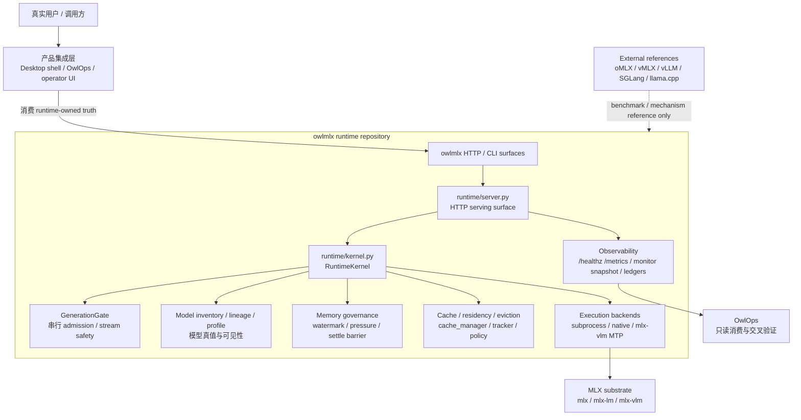
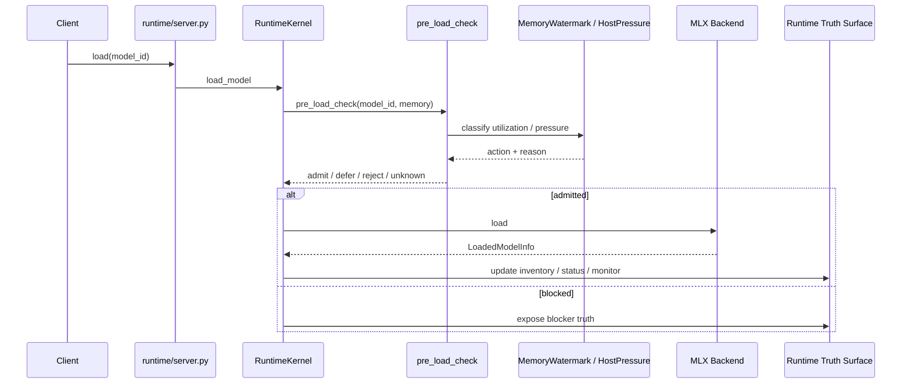
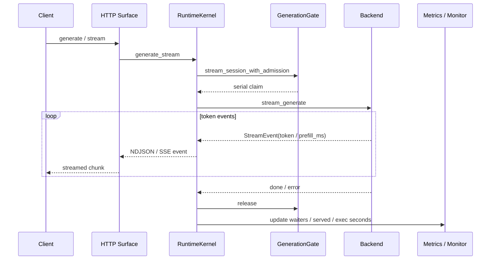
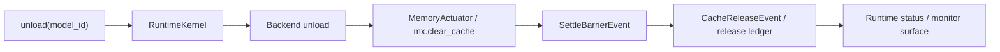
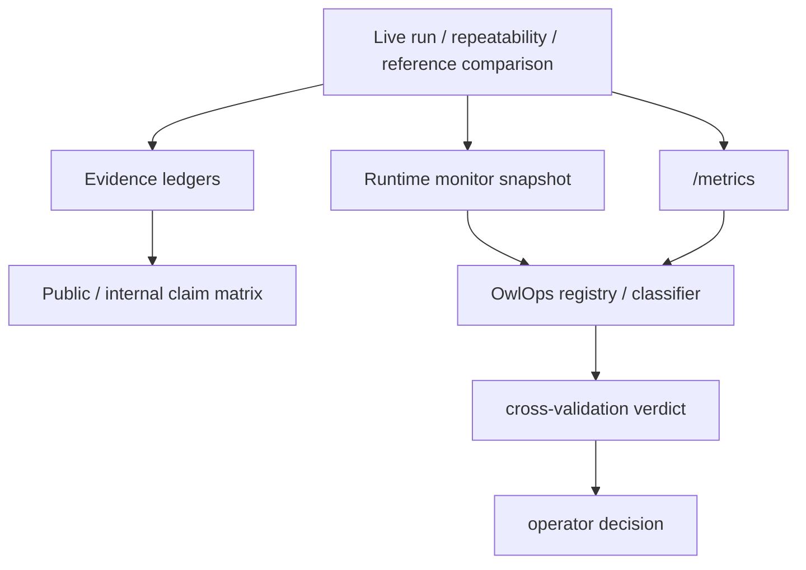

# owlmlx 系统架构、逻辑架构与设计蓝图

> Status: authoritative planning blueprint
> Updated: 2026-05-12
> Scope: Stage 1 -> Stage 3.2 runtime-spine refactor 后的中文总蓝图

## 0. 一句话定位

`owlmlx` 是一个 **memory-discipline-first 的 Apple Silicon 本地模型 runtime**。

它不是 `oMLX` / `vMLX` 的补丁栈，也不是桌面壳的附属模块。它拥有自己的 runtime 身份、运行时契约、内存治理、模型真值、执行路径、证据面和能力标签。外部 runtime 可以作为参考、基准和机制灵感，但不能定义 `owlmlx` 的身份。

最短的架构判断是：

```text
MLX substrate provides execution primitives.
owlmlx owns runtime truth and runtime decisions.
OwlOps / desktop shell consume owlmlx truth.
External runtimes are references, not dependencies.
```

中文展开：

- `mlx` / `mlx-lm` / `mlx-vlm` 是底层执行基座。
- `owlmlx` 是 runtime 自身，负责把底层执行能力变成可治理、可观测、可比较、可稳定交付的本地模型 runtime。
- OwlOps 和上层产品只消费 `owlmlx` 输出的 runtime-owned truth，不反向定义 runtime 真值。
- `oMLX` / `vMLX` / `vLLM` / `SGLang` / `llama.cpp` 等是对照物，不是母体。

## 1. 总体系统架构



这一张图的核心是三条单向关系：

1. **底层执行向上被封装**：`mlx` 系工具提供算子、加载、生成和模型生态，`owlmlx` 将其封装成 runtime 语义。
2. **runtime 真值向上流动**：上层产品、OwlOps、dashboard 只能读取或展示 runtime truth，不能替 runtime 发明 truth。
3. **外部项目横向参考**：外部 runtime 只用于性能对比、机制学习、行为验证，不是迁移目标或身份来源。

## 2. 物理代码架构

当前代码可以按六类理解。

| 层 | 主要文件 | 职责 |
|---|---|---|
| HTTP / serving surface | `owlmlx/runtime/server.py`, `owlmlx/runtime/technical_preview.py`, `owlmlx/runtime/serving_hardening.py` | 对外路由、OpenAI/Anthropic 兼容入口、runtime status、metrics、monitor、request id、错误 envelope |
| Runtime kernel | `owlmlx/runtime/kernel.py`, `owlmlx/runtime/types.py`, `owlmlx/serving.py` | load / unload / generate / stream_generate 编排，GenerationGate 串行安全，model registry 和生命周期状态 |
| Backend execution | `owlmlx/runtime/mlx_lm_subprocess_backend.py`, `owlmlx/runtime/mlx_native_backend.py`, `owlmlx/runtime/mlx_lm_runner.py`, `owlmlx/runtime/mlx_vlm_mtp_runner.py`, `owlmlx/gemma4_mtp_drafter.py` | 调用 MLX 生态执行模型；当前有 subprocess 主路径、native scaffold/路径、mlx-vlm MTP runner |
| Memory governance | `owlmlx/memory_watermark.py`, `owlmlx/memory_pressure_classifier.py`, `owlmlx/memory_actuator.py`, `owlmlx/host_pressure.py`, `owlmlx/settle_barrier_event.py`, `owlmlx/model_load_admission.py`, `owlmlx/nonresident_model_admission_policy.py` | 内存水位、加载前检查、释放验证、host pressure、可加载性判断 |
| Cache / residency / scheduler | `owlmlx/cache_manager.py`, `owlmlx/cache_residency_tracker.py`, `owlmlx/cache_scheduler_status.py`, `owlmlx/memory_pressure_eviction_policy.py`, `owlmlx/model_residency_policy.py`, `owlmlx/cache_truth.py` | 单请求 cache 生命周期、模型 residency 观测、scheduler/cache 诚实状态、后续 eviction 激活入口 |
| Evidence / truth / comparison | `owlmlx/model_release_candidate_*`, `owlmlx/comparative_evidence_*`, `owlmlx/repeatability_statistics.py`, `owlmlx/runtime_monitor_test_console.py`, `owlmlx/quantization_metadata.py`, `owlmlx/model_lineage.py`, `owlmlx/model_profile.py` | RC ledger、repeatability、reference comparison、runtime monitor、量化 metadata、模型来源和 profile 真值；旧 `repeatability_harness.py` scaffold 已归档到 `archive/spec-layer-v0/` |

## 3. 逻辑架构

### 3.1 Runtime Truth Plane

Truth plane 是 `owlmlx` 的主轴。它回答的不是“能不能跑”，而是“现在到底处于什么运行状态，哪些能力可以被诚实声明”。

核心出口：

- `GET /healthz`
- `GET /metrics`
- `GET /v1/runtime/status`
- `GET /v1/runtime/monitor/snapshot`
- `GET /v1/runtime/cache-scheduler-status`
- `GET /v1/runtime/memory-watermark`
- `GET /v1/runtime/quantization-metadata`
- Model RC ledger
- comparative evidence ledger
- runtime test-run ledger

设计原则：

- truth surface 必须 runtime-owned。
- `supported` / `partial` / `experimental` / `not in scope` 不能混用。
- post-run health clean 不能替代 generation success。
- 文档存在不能自动促升能力。

### 3.2 Execution Plane

Execution plane 负责真实生成。

当前执行形态：

- `MlxLmSubprocessBackend`：当前主路径，隔离 child runner，靠 structured JSON line / stream event 对接。
- `MlxNativeBackend`：native MLX 路径，目标是进程内拿到 model/tokenizer/cache 等句柄，减少 transport 问题，为后续 scheduler/cache 深度打基础。
- `mlx-vlm MTP runner`：Gemma4 / MTP / speculative 路线的实验入口。

当前保守 invariant：

- `GenerationGate` 串行。
- 不声明 continuous batching。
- 不声明 prefix-cache parity。
- 不把 subprocess transport sentinel 当长期能力方向。

### 3.3 Memory Governance Plane

Memory plane 是 `owlmlx` 和普通 wrapper 拉开距离的第一主轴。

它负责：

- 用 `MemoryWatermark` 将内存水位标准化为 GREEN / YELLOW / RED / FATAL / UNKNOWN。
- 用 `WatermarkAction` 给出 PROCEED / EVICT_LRU / AGGRESSIVE_EVICT / REFUSE_LOAD / DEFER 这类 runtime 动作建议。
- 用 `pre_load_check` 在加载前做非 resident 模型 admission。
- 用 `SettleBarrierEvent` 记录 unload 后内存释放是否真的 settle。
- 用 `MemoryActuator` 对接 `mx.clear_cache` / cache limit / memory 读数等执行能力。

关键原则：

1. host safety 高于吞吐。
2. memory truth 高于调度欲望。
3. unload 不能只返回“已调用”，要能形成 release / settle 证据。

### 3.4 Cache / Residency / Eviction Plane

Cache plane 是下一阶段最重要的 runtime-owned 能力闭环。

当前状态：

- `cache_manager.py` 已成为 KV cache 获取的 canonical gateway。
- `cache_residency_tracker.py` 已有模型 residency / release ledger 的基础。
- `cache_scheduler_status.py` 能诚实暴露当前仍是 serial single worker / truth-only cache 的事实。
- LRU / PromptTrie 方向有可行性入口，但不能当作已激活 prefix cache 能力。

下一阶段目标不是“马上做 vLLM 式调度”，而是先打穿这个闭环：

```text
load decision
  -> residency state
  -> memory pressure signal
  -> deterministic eviction candidate
  -> unload / release ledger
  -> runtime status evidence
```

这条闭环完成后，`owlmlx` 才真正拥有可解释的本机多模型内存治理，而不是只有“模型能跑”的证据。

### 3.5 Model Truth Plane

Model truth plane 负责回答：

- 这个模型来自哪里？
- 是什么量化形态？
- 是否符合 native backend input contract？
- 是否在 runtime 可见？
- 是否有 RC / repeatability / reference comparison 证据？

核心模块：

- `model_lineage.py`
- `quantization_metadata.py`
- `model_profile.py`
- `model_inventory.py`
- `runtime_model_visibility.py`
- `model_release_candidate_record.py`
- `comparative_evidence_record.py`

设计边界：

- 同一个模型的 `fp16/bf16/4bit/2bit-DQ/MoE` 不是同一条性能证据。
- `mlx_lm.load()` 成功只能证明 load-path-compatible，不自动证明 production-supported。
- 参考 runtime 的跑分只能作为 comparison evidence，不是 `owlmlx` 身份来源。

### 3.6 Observability / Evidence Plane

Observability plane 让 runtime 自己产出证据，不靠人工读目录拼结论。

核心形态：

- `/metrics` Prometheus text
- monitor snapshot
- trend ledger
- model RC ledger
- runtime test-run registry
- comparative evidence ledger
- OwlOps cross-validation

设计重点：

- 证据必须能反向约束 public claim。
- live endpoint、ledger、OwlOps 消费结果要能互相校验。
- `metrics_only` / `snapshot_only` / `insufficient_signal` 这类状态要保留，不补成假 0。

## 4. 关键运行流

### 4.1 加载流



加载不是简单 `load()`，而是 admission、memory truth、backend result、runtime status 的组合决策。

### 4.2 生成流



这里的核心不是“能流式输出 token”，而是 token 前、token 中、done/error 之后都要有一致的 runtime truth。

### 4.3 卸载与释放流



卸载完成的定义不是“函数返回”，而是：

- backend 状态已清理；
- runtime inventory 已更新；
- cache / residency release 有记录；
- memory settle 有可解释信号；
- post-run health 能被 endpoint 消费。

### 4.4 证据流



证据流的目标是让 claim 被 runtime evidence 约束。没有证据的能力，只能留在 `partial` / `experimental` / `not in scope`。

## 5. 能力状态总表

| 能力域 | 当前标签 | 说明 |
|---|---|---|
| Runtime identity / architecture truth | supported | `owlmlx` 独立 runtime 身份已冻结；不是 fork / wrapper / patch stack |
| HTTP runtime truth surface | supported | healthz、metrics、status、monitor、memory-watermark、quantization-metadata 等已成 runtime-owned surface |
| Serial generation safety | supported | `GenerationGate` 串行边界是当前安全地板 |
| MLX subprocess execution | supported | 当前主路径能真实 load/generate/stream，但仍受 child transport 限制 |
| Native MLX backend | partial | 已证明可行和部分真实 binding，仍不是主 serving path 的完整替代 |
| Memory watermark / pre-load admission | supported | PR #649 对齐词汇已进入 runtime consumer path |
| Settle barrier / release evidence | partial | 合约和 surface 在场，更深的 eviction/release campaign 仍要继续 |
| Cache manager / residency tracker | partial | gateway 与 tracker 已在场，下一步是 eviction loop 激活 |
| Prefix cache / cross-request KV reuse | not in scope 当前阶段 | 不能用 LRU/Trie feasibility 代替已激活能力 |
| Continuous batching | not in scope 当前阶段 | 与当前 serial safety posture 冲突，除非未来 native scheduler 另开主线 |
| Reference comparison | partial / evidence-scoped | 可与 oMLX/vMLX/官方 mlx_lm 对比，但比较结果按模型、量化和 workload 限定 |
| OwlOps consumption | supported as downstream consumption path | OwlOps 消费 truth，不定义 truth；UI 展示节奏不反向改变 runtime contract |

## 6. 边界规则

### 6.1 owlmlx 拥有

- runtime 身份
- runtime 架构和路线
- capability label
- HTTP / CLI runtime truth surface
- model load / unload / generation lifecycle
- memory governance
- cache / residency / eviction policy
- evidence ledgers and claim constraints
- reference comparison harness 的 runtime 侧语义

### 6.2 owlmlx 不拥有

- OwlOps UI 叙事和交互设计
- desktop shell 的产品定义
- 外部 runtime 的 patch lifecycle
- Agent-side `oMLX` patch guard 的退役
- 外部 runtime 的功能品牌或身份

### 6.3 外部 runtime 的正确位置

| 外部对象 | 正确关系 | 错误关系 |
|---|---|---|
| `oMLX` | reference / benchmark / comparison | owlmlx 的父项目、patch target、迁移母体 |
| `vMLX` | reference / benchmark / mechanism comparison | owlmlx 的能力来源 |
| `vLLM` / `SGLang` | scheduler/cache 机制参考 | 直接 claim parity 的依据 |
| `mlx-lm` / `mlx-vlm` | substrate API / model ecosystem | runtime truth 的定义者 |
| Agent-side oMLX patch scripts | external legacy reference | Stage 3.2 extraction target |

## 7. 设计原则

1. **runtime truth flows upward**：真值从 `owlmlx` 往上流，产品层不反向定义 runtime。
2. **host safety first**：主机安全优先于吞吐、跑分和漂亮 demo。
3. **memory before scheduling**：没有 memory truth 的 scheduler 是危险的。
4. **adoption is not identity**：可以借机制，不能借身份。
5. **evidence before promotion**：能力促升必须有可重跑证据。
6. **no module-as-spec**：新 Python 模块必须被 `owlmlx/runtime/` 消费，字段必须被真实 runtime 决策读取。
7. **serial safety is a floor, not destiny**：当前串行是安全地板，不是永远目标；但任何解封都必须有新的 runtime-owned 证据。

## 8. 下一阶段设计蓝图

### 8.1 Stage 3.2 Track A：独立性清理

目标：把文档里的 residual migration framing 清干净。

交付：

- `system-architecture.md` 明确 `owlmlx` 独立 runtime。
- `contract-mapping.md` 把 Agent-side oMLX patch scripts 归类为 `external legacy reference`。
- `extraction-inventory.md` 明确这些脚本不是 owlmlx extraction target。
- handoff 文件撤回“swap-safe migration audit”说法。

禁止：

- 不动 runtime 代码。
- 不碰 Agent repo。
- 不宣称 patch guard retired。

### 8.2 Stage 3.3 Track B：Cache / Residency / Eviction 激活

目标：完成第一个真正 runtime-owned memory/cache 闭环。

闭环：

```text
pre-load decision
  -> model residency state
  -> memory pressure classification
  -> deterministic eviction candidate
  -> unload through normal runtime path
  -> release ledger
  -> status / monitor evidence
```

验收：

- pinned model never evicted。
- active / hot model 不被普通 pressure 牺牲。
- evictable first。
- 同级使用 deterministic LRU。
- release ledger 记录 reason / model_id / use_count / sequence。
- `/v1/runtime/status` 或专门 status surface 能看到 eviction state。

禁止：

- 不 claim prefix cache。
- 不 claim continuous batching。
- 不 claim cache parity。

### 8.3 Stage 4：深能力路线

Stage 4 不应该继续堆 surface，而应该转向真正改变 runtime 能力的深水区：

1. **Host-stable repeatability campaign**
   - 多模型 N>=20 repeatability。
   - 记录 TTFT/TPS 方差、post-run health、terminal integrity。
   - 把结果写入 Model RC ledger。

2. **Native backend 深化**
   - 从 subprocess transport 逐步转向 native handle ownership。
   - 明确哪些能力只有 native path 能拿到：cache handle、sampler hook、token-level cancel、prefill/decode seam。

3. **Scheduler depth**
   - 在 memory/cache 闭环之后，再讨论 request-level scheduler。
   - 先做 admission 和 residency-aware dispatch，再谈 batching。

4. **Prefix cache / KV reuse**
   - 只有当 single-request cache ownership 和 eviction loop 稳定后才进入。
   - 必须有污染隔离测试，不能只看 TPS。

5. **Model-family bring-up**
   - Qwen / Gemma / DeepSeek 继续按 model-family truth 管理。
   - 每条模型线单独记录 quantization、provenance、load path、repeatability。

6. **OwlOps Wave 8+**
   - 只消费已有 truth。
   - UI 展示不能提前制造 runtime 没有的概念。

## 9. 红军视角的主要风险

| 风险 | 为什么危险 | 对策 |
|---|---|---|
| truth surface 跑得比真实稳定性快 | 看起来像完整 runtime，真实用户压测时暴露 terminal / lifecycle 问题 | 每个 surface 必须绑定 behavior evidence 或明确 `insufficient_signal` |
| 文档迁移误读成代码迁移 | 会把 Agent-side oMLX patch 误当 owlmlx 主线 | Stage 3.2 Track A 只做独立性清理，明确 external legacy reference |
| cache feasibility 被误读成 cache ability | LRU/Trie 存在不等于 prefix cache 激活 | Track B 只 claim eviction/residency，prefix cache 另开 |
| supported 标签膨胀 | public / internal claim 会失真 | 按 capability matrix promotion rule 守门 |
| 重回 spec-as-code | 低成本新增 dataclass 文件会重新制造 Stage 1 问题 | 新 `.py` 必须 runtime consumer + field reads |
| 只追 TPS | local runtime 的稳定性、memory safety、repeatability 可能被掩盖 | TPS 与 TTFT、方差、post-run health、terminal integrity 一起看 |

## 10. 决策摘要

当前 `owlmlx` 的主线不是泛化公开发布，也不是“追外部 runtime 的全部功能”。当前主线是：

```text
把 Apple Silicon 上的本地模型执行能力，
收束成一个 memory-governed、truth-owned、evidence-driven、
可被 OwlOps 和上层产品稳定消费的独立 runtime。
```

下一阶段最值得并行的两条线是：

- **Track A**：文档和边界清理，完成独立性叙事纠偏。
- **Track B**：runtime 能力深化，完成 cache / residency / eviction 闭环。

这两条可以并行，因为它们的写入面完全不同：

- Track A 写 docs / handoff / PR body。
- Track B 写 runtime/cache/memory/kernel/tests。

合并顺序建议：

1. Track A 先合，保证架构地图正确。
2. Track B 后合，把能力推进落在正确地图上。

## 11. 当前发布通道拆分

`owlmlx` runtime engineering release 不再交给 OwlCoda 产品闭环单方面决定。

当前通道拆分冻结在 `public-release-standard.md`：

- `owlmlx` 自己拥有 runtime engineering release 权限；
- OwlCoda npm local-model learning loop 是下游 consumer readiness / product
  acceptance gate；
- public marketing release 仍等待产品层证明。

下游 consumer readiness 证明仍是：

```text
OwlCoda npm package
  -> owlmlx local model
  -> self-training data accumulation
  -> learning / adaptation step
  -> learned artifact or state registered back into runtime truth
  -> OwlCoda consumes the updated local-model path again
```

这条线是下游 consumer readiness 验收门，不是当前 `owlmlx` 的实现主线。当前主线仍是
`owlmlx` 自身 runtime 能力，尤其是 cache / residency / eviction、模型 lineage、
artifact registration、repeatability 这些未来被 OwlCoda 消费所依赖的基础。

在这些 runtime 前置能力打稳之前，不应该启动 OwlCoda 侧的集成实现线。
